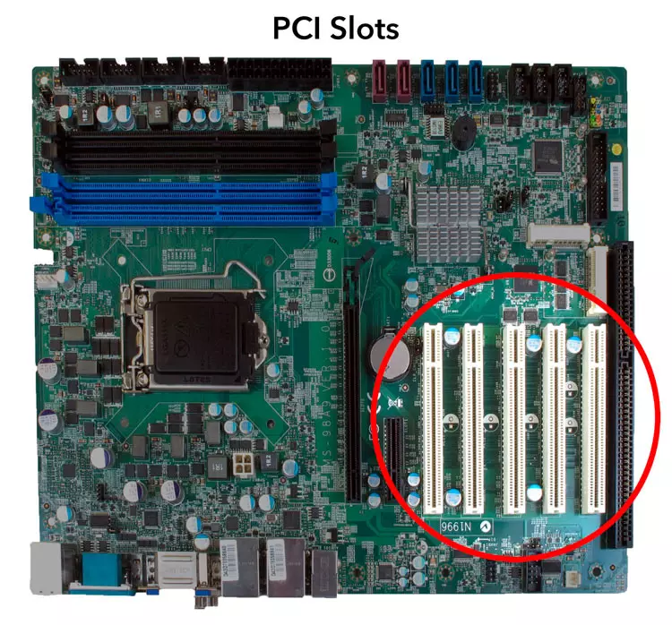

## Placa base 

1. Procesador(CPU) "(color lila claro)": Generalmente, el procesador se encuentra en el centro de la placa base, conectado a un zócalo. a CPU es el cerebro del ordenador. Es responsable de ejecutar todas las instrucciones y realizar los cálculos necesarios para que el sistema funcione. 

2. Conjunto de chips "(color granate y color blanco)": El Northbridge está ubicado cerca de la CPU, mientras que el Southbridge se encuentra más alejado, generalmente en la parte inferior de la placa base.El chipset actúa como intermediario entre la CPU y otros componentes. El Northbridge se encarga de gestionar la comunicación rápida entre la CPU, la memoria RAM y la tarjeta gráfica integrada. El Southbridge maneja los dispositivos periféricos más lentos, como los puertos USB.

3. Ranuras de memoria RAM "(color amarillo fuerte)": Se encuentran al lado de la CPU, generalmente en una fila o en varias filas alrededor de ella.Las ranuras de memoria permiten instalar los módulos de RAM. La RAM almacena de manera temporal los datos que está utilizando activamente la CPU.Los tipos más comunes son DDR4 y DDR5.

4. BIOS/UFIE "(color gris)": El chip BIOS o UEFI está ubicado cerca de la CPU, en una zona pequeña de la placa base.La BIOS  o UEFI  es un software almacenado en un chip que se encarga de inicializar los componentes del ordenador al arrancar.

5. Ranuras de expansión:

Las ranuras de expansión se encuentran a lo largo de la placa base, generalmente en la parte inferior o en el centro, y tienen diferentes tamaños.Estas ranuras permiten agregar tarjetas de expansión, como tarjetas gráficas, de sonido, de red, etc. PCIe (Peripheral Component Interconnect Express) es el tipo más moderno de ranura y ofrece altas velocidades de transferencia de datos.

6. Conexiones de la fuente de alimentación "(color amarillo claro)": Se encuentran en la parte superior o lateral de la placa base.Estos conectores permiten conectar la placa base a la fuente de alimentación del ordenador. Suministran energía a todos los componentes del sistema. Los conectores más comunes son el de 24 pines (para la placa base) y el de 4 u 8 pines (para el procesador).

7. Puertos de almacenamiento "(color verde)": Los puertos SATA suelen estar cerca de las ranuras de memoria, mientras que los puertos M.2 para NVMe están más cerca de la CPU o en una ubicación central.Estos puertos permiten conectar dispositivos de almacenamiento como discos duros ,que ofrecen velocidades de transferencia de datos mucho más rápidas.

8. Puerto de red ethernet "(color rojo)" : Los puertos de red Ethernet se encuentran generalmente en la parte posterior de la placa base, junto a otros puertos de comunicación.Permiten conectar el ordenador a una red local para acceder a Internet o para comunicarte con otros dispositivos en la red.

9. Puertos externos y paralelo "(color azul y marron)": Los puertos USB, HDMI y otros conectores externos están en la parte trasera de la placa base. Los conectores internos (para USB frontales, audio, etc.) suelen estar ubicados en la parte inferior.Permiten conectar dispositivos externos como teclados, ratones, monitores, etc.

10. Pila "(color verde flojo)": La batería es pequeña (tipo CR2032) y se encuentra cerca del chip BIOS/UEFI.Esta batería permite que la BIOS retenga la configuración del sistema, como la fecha y la hora, incluso cuando el ordenador está apagado. Sin ella, estos valores se perderían cada vez que el sistema se desconectara de la corriente.

## Interacción del sistema con tres componentes
- La CPU es el corazón del sistema, encargada de procesar las instrucciones y cálculos. Cuando necesita acceder a datos que no están en su memoria interna, consulta la memoria RAM.
- La memoria RAM almacena temporalmente los datos y las instrucciones que la CPU está utilizando en ese momento. Al ser mucho más rápida que un disco duro, la CPU primero busca los datos en la RAM antes de recurrir a dispositivos de almacenamiento más lentos.
- El chipset, que se divide en Northbridge y Southbridge, facilita la comunicación entre la CPU, la RAM y otros componentes. El Northbridge se encarga de gestionar las conexiones rápidas, como la memoria RAM y la CPU, mientras que el Southbridge se ocupa de las conexiones más lentas, como las ranuras de expansión y puertos de almacenamiento.
### Resumen 
- CPU: Procesa datos y ejecuta instrucciones.
- RAM: Almacena temporalmente los datos activos.
- Chipset: Facilita la comunicación entre los componentes principales, coordinando la CPU con la memoria y otros periféricos.

